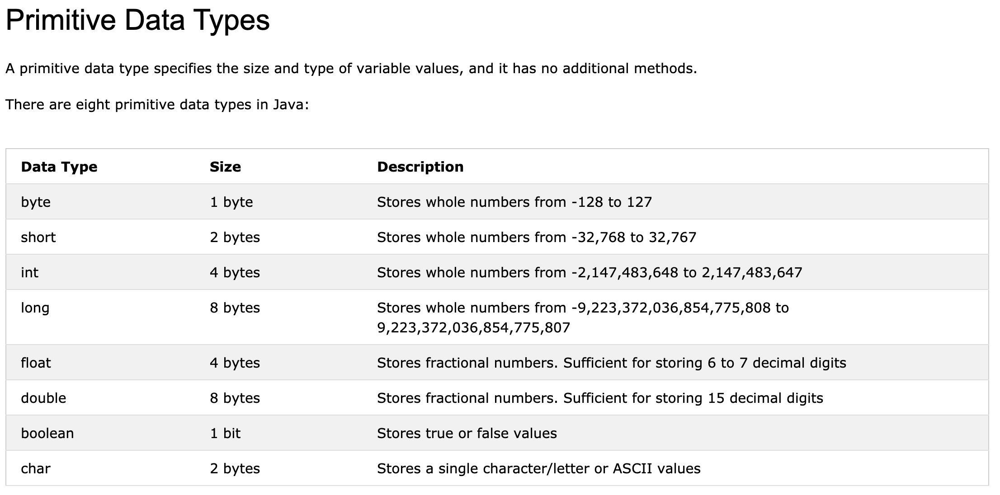

## Before anything
* Jan 28 Thu, 2021 Sunny start  
* Prior knowledge: Python(2.5 years, several school assignments, leetcode language), C(1.5years, several school assignments), Java(1 semester, only 1 assignment), Javascript(0.5 year, 2 projects and 2 assignments)
* **Focus**: Stuff that I do not know about Java, not everything about Java

## Table of Contents


## Basic Ideas

### The Java programming language
* general-purpose, high-level
* In Java, all source code is first written in plain text files with **.java** extension. Those source files are then compiled into **.class** files by the **javac** compiler. A **.class** file does not contain code that is native to your processor; it instead contains bytecodes — the machine language of the Java Virtual Machine1 (Java VM). The java launcher tool then runs your application with an instance of the Java VM.

<p align="center">*Ilustration(image from Oracle)*</p>

* Because the Java VM is available on many different operating systems, the same .class files can be run in different OS'.

### The Java Platform
* A platform is the hardware or software environment in which a program runs, can be described as a combination of the operating system and underlying hardware
* Java platform **differs** from most other platforms in that it's a **software-only** platform that runs on top of other hardware-based platforms.
* The Java platform has two components:
	* The Java Virtual Machine
	* The Java Application Programming Interface (API) 
		* The API is a large collection of ready-made software components that provide many useful capabilities. It is grouped into libraries of related classes and interfaces; these libraries are known as **packages**.
* As a **platform-independent** environment, the Java platform is **slower than native code**.
	
	<p align="center">*Ilustration(image from Oracle)*</p>

## Varibles
* Similar to C, need to declare type when creating a variable
* ```int num; num = 1;```
* ```type variable_name = value;```

### final variable
* add ```final``` keyword so that others cannot overwirte existing values

* ```
final int num = 1;    
num = 2; // will generate error
 ```

### Type

	<p align="center">*Ilustration(image from W3Schools)*</p>

### Type Casting
* Widening casting (auto)
	* from smaller type to larger 
	<pre>int intA = 9;
	 double doubleA = intA; </pre>
* Narrowing casting (manual)
	* from larger to smaller
	* ```double doubleA = 9.0; int intA = (int) doubleA;```

### Operator
* / : ```int a = 10 / 3; // a = 3, use floor```

## Method
	
## public static void main(String[] args)
* the main() method
* required
* Any code inside the main() method will be executed.
* Detailed explaination
	* public
		* It is the **Access modifier**,  specifies from where and who can access the method
		* Making the main() method public makes it globally available. It is made public so that JVM can invoke it from outside the class as it is not present in the current class.
		* My understanding: public vs private
	* static
		*  a *keyword*
		*  when associated with a method, make it a class related method.
		*  The main() method is static so that JVM can invoke it without instantiating the class. 
		*  This also saves the unnecessary wastage of memory which would have been used by the object declared only for calling the main() method by the JVM. 
	* void
		* a *keyword*
		* specify a method does not return anything.
		* It doesn’t make any sense to return from main() method as JVM can’t do anything with the return value of it.
		* My understanding: return type, similar to C, however, C and C++ use **int**
			* The C and C++ programs which return int from main are processes of Operating System. The int value returned from main in C and C++ is exit code or exit status
			* The java program runs as ‘main thread’ in JVM. The Java program is not even a process of Operating System directly. There is no direct interaction between Java program and Operating System. There is no direct allocation of resources to Java program directly, or the Java program does not occupy any place in process table. Whom should it return exit status to, then. Which is why main method of Java is designed not to return int or exit status.
			* JVM is a process of a operating system, and JVM can be terminated with certain exit status. With help of java.lang.Runtime.exit(int status) or System.exit(int status)
	* main
		* Conventional name
		* It is the name of Java main method. It is the identifier that the JVM looks for as the starting point of the java program. 
		* If not using main, will error
	* String[] args
		* Array of String
		* *args* is not fixed, can be change to anything
		* My understanding: similar to C, accept command line arguments


## Resources
* https://docs.oracle.com/javase/tutorial/java/index.html
	* This is the first website I used to learn Java, it has a trail that you can follow to learn Java step by step
* https://www.w3schools.com/java/default.asp
	* W3shcools, one of the most popular website to learn new things

# Credits